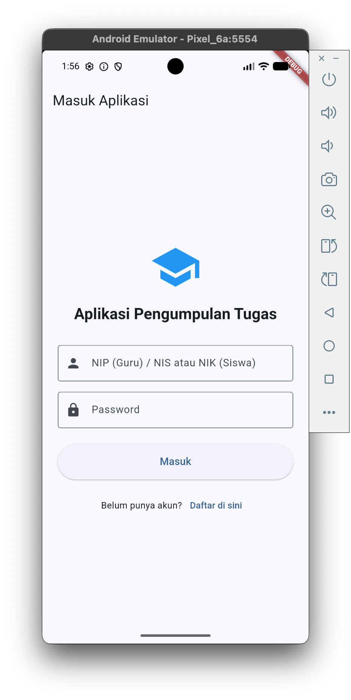
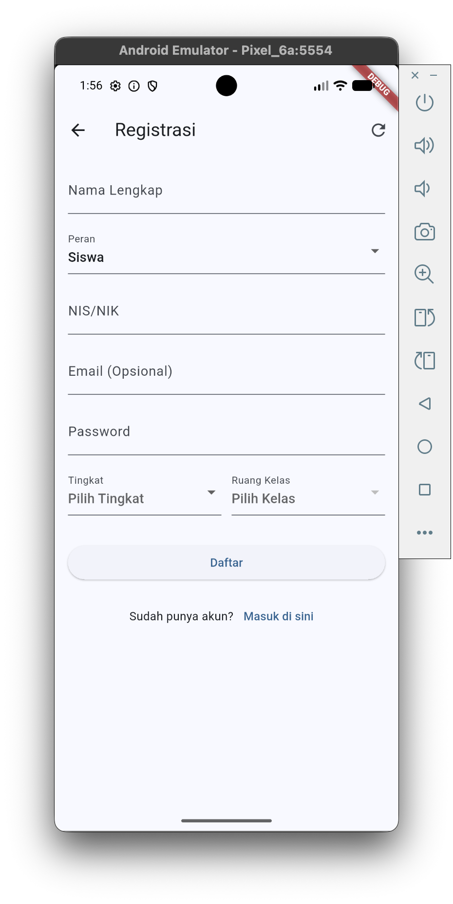
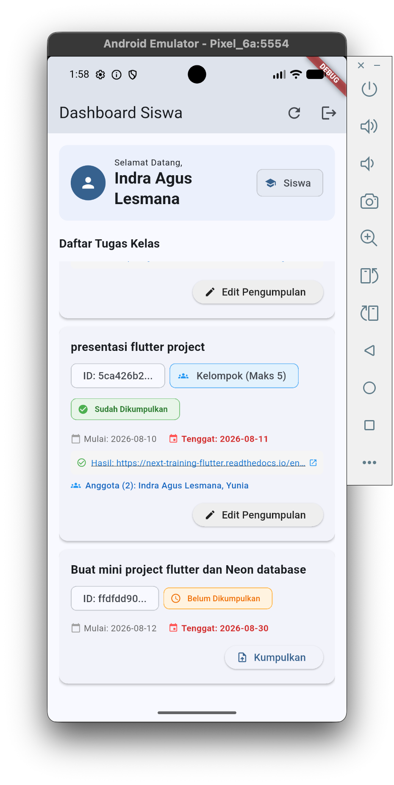
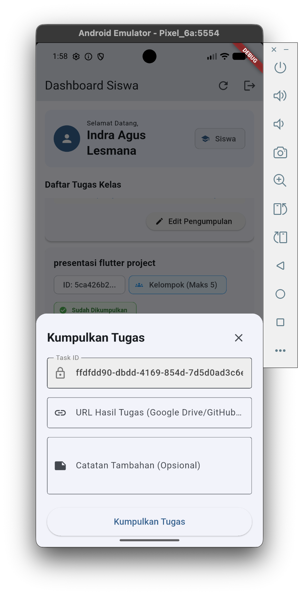
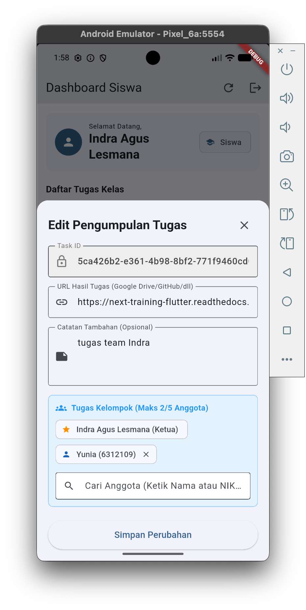
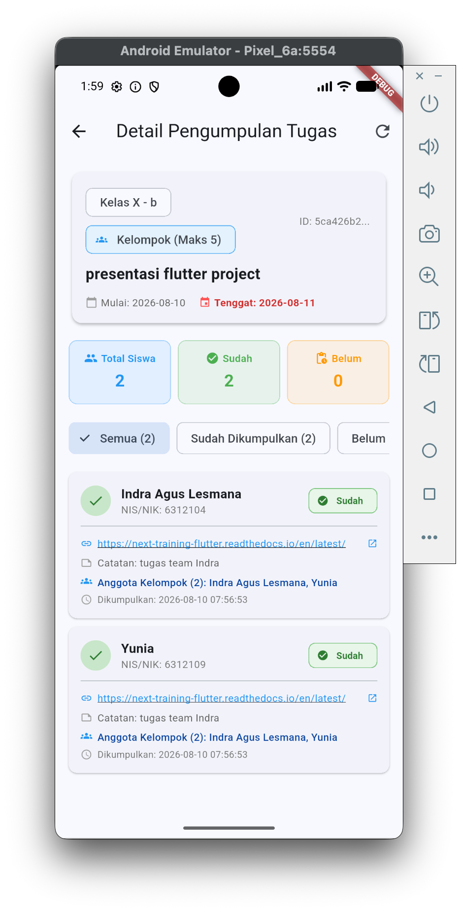
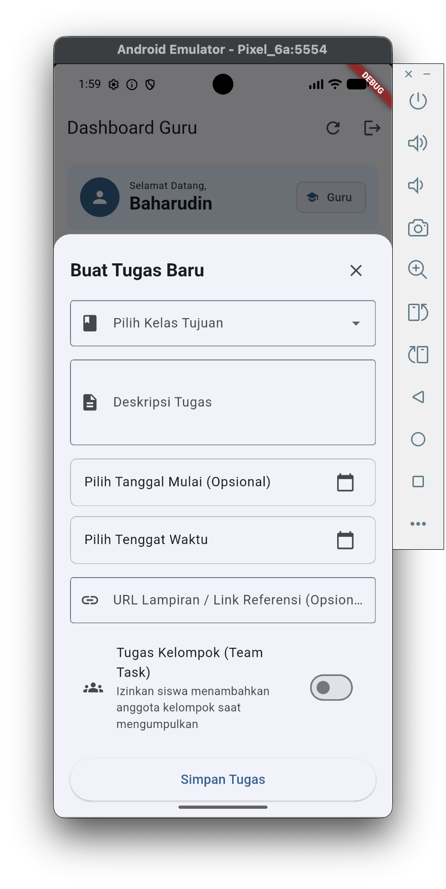

# Session 1: Perencanaan & Desain Aplikasi + Dasar Flutter

> **Hari 1 — Sabtu, 15 Agustus** (09:30–12:00 pagi, 13:00–14:30 siang, break 12:00–13:00)

> **Branch workflow sesi ini:**
> - Mulai dari branch **`session-1-start`** (scaffold `fvm flutter create` — kosong)
> - Hasil akhir sesi ini tersimpan di branch **`session-1-final`** (app tugas minimal)
> - Di akhir sesi kita bandingkan dengan `git diff` dan mengambil referensi dengan `git checkout session-1-final -- flutter_training/`

## Objectives
- Memahami **gambaran besar aplikasi**: alur pengguna, arsitektur, ERD 5 tabel, dan peta 4 sesi
- Membuat project Flutter dari nol dengan `fvm flutter create`
- Memahami dasar bahasa Dart: variabel, tipe data, class, constructor
- Memahami widget Flutter: `StatelessWidget` vs `StatefulWidget`, widget tree, layout
- Membangun **aplikasi tugas minimal**: daftar tugas, checkbox, tambah/hapus, dengan `setState` + `Provider`
- Mengenal HTTP dasar dengan package `http`

## Agenda (4 jam efektif)
1. Pembukaan & ice-breaking (10 menit)
2. **Perencanaan & Desain Aplikasi** (40 menit)
3. `fvm flutter create` & struktur project (30 menit)
4. Dart Essentials (30 menit)
5. Widget & Layout Flutter (30 menit)
6. Layout & ListView (30 menit)
7. State: `setState` + Provider (50 menit)
8. HTTP dasar dengan `http` (30 menit)
9. Review, diff, & catch-up (15 menit)

---

## 1. Pembukaan

- Tujuan 4 sesi & hasil akhir yang akan dicapai
- **Demo hasil akhir** — jalankan app dari branch `session-4-final` (aplikasi lengkap end-to-end)
- Cek kesiapan: Flutter SDK (FVM), VS Code, emulator/device
- Clone repo & checkout `session-1-start`

```bash
git clone https://github.com/indraAsLesmana/next-training-flutter.git
cd next-training-flutter
git checkout session-1-start
```

> **Apa yang ada di `session-1-start`?** Scaffold Flutter kosong hasil `fvm flutter create` — hanya `main.dart` counter bawaan. Kita akan membangun semuanya dari nol hari ini.

---

## 2. Perencanaan & Desain Aplikasi

> Bagian ini memberi **gambaran besar** sebelum mulai coding: apa yang kita bangun, siapa penggunanya, bagaimana data mengalir, dan bagaimana database dirancang.

### 2.1 Gambaran Proyek

**Aplikasi Pengumpulan Tugas** — aplikasi untuk sekolah dengan 2 peran pengguna:

| Peran | Identitas | Bisa Melakukan |
|---|---|---|
| **Guru** | NIP (Nomor Induk Pegawai) | membuat tugas (individu/kelompok), melihat pengumpulan |
| **Siswa** | NIK (Nomor Induk Kependudukan) | Melihat tugas kelas, mengumpulkan tugas (link URL), cek status |

#### 2.1.1 Hasil Akhir Aplikasi (Screenshot)

Ini **tampilan aplikasi yang akan kita bangun** selama 4 sesi:

| | |
|---|---|
| **1. Login** | **2. Register** |
|  |  |
| **3. Home Siswa** | **4. Submit Tugas (individu)** |
|  |  |
| **5. Submit Tugas (kelompok)** | **6. Progress Tugas Guru** |
|  |  |
| **7. Pengumpulan Tugas Guru** | |
|  | |

> **Catatan:** Screenshot di atas adalah hasil akhir dari seluruh training (branch `session-4-final`).

### 2.2 Alur Pengguna

```{mermaid}
flowchart TD
    A[Register: NIP/NIK + password] --> B[Login]
    B --> C{Role?}
    C -->|guru| D[Dashboard Guru<br>buat kelas & tugas]
    C -->|siswa| E[Dashboard Siswa<br>lihat tugas kelas]
    D --> F[Buat Tugas<br>individu / kelompok]
    E --> G[Kumpulkan Tugas<br>isi link URL]
    F --> H[Siswa kumpulkan]
    G --> I[Guru cek status<br>pengumpulan]
```

### 2.3 Arsitektur Aplikasi

```{mermaid}
flowchart LR
    F["Flutter App<br>flutter_training/"] -->|"HTTP / JSON"| A["Hono API<br>flutter-task-api/"]
    A --> D[("Neon PostgreSQL<br>5 tabel")]
```

| Layer | Teknologi | Peran |
|---|---|---|
| **Client** | Flutter (Dart) | UI, state management (Provider), HTTP client (Dio) |
| **Backend** | Hono (TypeScript) | REST API, validasi, logika bisnis |
| **Database** | Neon PostgreSQL | Penyimpanan data (serverless) |

### 2.4 ERD Database (5 Tabel)

```{mermaid}
erDiagram
    CLASSES ||--o{ USERS : "contains (role=siswa)"
    CLASSES ||--o{ TASKS : "assigned to"
    USERS ||--o{ TASKS : "creates (role=guru)"
    USERS ||--o{ SUBMISSIONS : "submits (role=siswa)"
    TASKS ||--o{ SUBMISSIONS : "has"
    SUBMISSIONS ||--o{ SUBMISSION_MEMBERS : "includes"
    USERS ||--o{ SUBMISSION_MEMBERS : "member of"

    CLASSES {
        uuid id PK "Primary Key"
        varchar tingkat "Tingkat kelas: X, XI, XII"
        varchar nama_kelas "Nama kelas: a, b, c, d"
        timestamp created_at "Timestamp pembuatan"
    }

    USERS {
        uuid id PK "Primary Key"
        varchar nama "Nama lengkap user"
        varchar role "Role user: 'guru' | 'siswa'"
        varchar nip_nik "Unique NIP/NIK"
        varchar email "Email user (Opsional)"
        text password_hash "Password hash / plain"
        uuid class_id FK "Foreign Key -> classes.id (Siswa Only)"
        timestamp created_at "Timestamp pendaftaran"
    }

    TASKS {
        uuid id PK "Primary Key"
        uuid guru_id FK "Foreign Key -> users.id (Guru)"
        uuid class_id FK "Foreign Key -> classes.id"
        text description "Deskripsi tugas"
        timestamp start_date "Tanggal & waktu mulai"
        timestamp end_date "Tenggat waktu pengumpulan"
        text attachment_url "Link file lampiran (Opsional)"
        boolean is_team_task "Flag tugas kelompok"
        integer max_team_members "Maksimal anggota per tim"
        timestamp created_at "Timestamp pembuatan"
    }

    SUBMISSIONS {
        uuid id PK "Primary Key"
        uuid task_id FK "Foreign Key -> tasks.id"
        uuid siswa_id FK "Foreign Key -> users.id (Siswa/Leader)"
        text submit_url "URL hasil tugas (Drive/GitHub)"
        text notes "Catatan tambahan (Opsional)"
        timestamp submitted_at "Waktu pengumpulan"
    }

    SUBMISSION_MEMBERS {
        uuid id PK "Primary Key"
        uuid submission_id FK "Foreign Key -> submissions.id"
        uuid siswa_id FK "Foreign Key -> users.id (Siswa Anggota)"
        timestamp created_at "Timestamp penambahan"
    }
```

| Tabel | Isi | Relasi penting |
|---|---|---|
| `classes` | Kelas (nama, tingkatan) | 1 kelas → banyak users/tasks |
| `users` | Guru & siswa (NIP/NIK, role, classId) | role: `guru`/`siswa` |
| `tasks` | Tugas (guruId, classId, tanggal, link, isTeamTask) | dibuat guru untuk kelas |
| `submissions` | Pengumpulan (taskId, siswaId, link) | 1 tugas ← banyak pengumpulan |
| `submission_members` | Anggota tugas kelompok | 1 pengumpulan → banyak anggota |

### 2.5 Ringkasan API

| Method | Endpoint | Fungsi |
|---|---|---|
| `POST` | `/api/auth/register` | Daftar (NIP/NIK + password) |
| `POST` | `/api/auth/login` | Masuk |
| `GET` | `/api/classes` | Daftar kelas |
| `GET` | `/api/students/search?classId=&query=` | Cari siswa per kelas |
| `POST` | `/api/tasks` | Guru membuat tugas |
| `GET` | `/api/tasks?classId=&siswaId=` | Siswa melihat tugas |
| `POST` | `/api/submissions` | Siswa mengumpulkan |
| `GET` | `/api/tasks/:id/submissions` | Status pengumpulan |

> **Detail backend dibahas di Session 3.** Untuk sekarang, cukup pahami *bentuk* API-nya.

#### 📥 Coba API Langsung di Apidog

Collection Apidog sudah disiapkan — **import & langsung coba** tanpa setup manual:

- **File:** [`docs/apidog/next-training-api.yaml`](apidog/next-training-api.yaml)
  - *GitHub raw:* <https://raw.githubusercontent.com/indraAsLesmana/next-training-flutter/build-project/docs/apidog/next-training-api.yaml>

**Cara pakai:**
1. Buka <https://apidog.com> → **Import** → pilih file `next-training-api.yaml` (atau tempel URL raw GitHub)
2. Apidog akan membuat collection dengan `servers` berisi placeholder `{{API_BASE_URL}}`
3. Buat **Environment** di Apidog (ikon ⚙️ → Environment) — dua pilihan:
   - **`Dev`** → set variabel `API_BASE_URL = http://localhost:8787` (backend Hono lokal)
   - **`Prod`** → set variabel `API_BASE_URL = https://br-raspy-bird-ay9c83zx-todos.compute.c-5.us-east-2.aws.neon.tech` (Neon serverless)
4. Pilih environment aktif, lalu salah satu endpoint (mis. `POST /api/auth/register`) → **Send** 🚀
5. Alur lengkap untuk dicoba: `register` (guru + siswa) → `login` → `GET /api/classes` → `POST /api/tasks` → `POST /api/submissions` → `GET /api/tasks/:id/submissions`

> **Contoh alur lengkap (Dev):** nyalakan backend (`cd flutter-task-api && npm run dev`, port 8787), lalu di Apidog pilih env **Dev**. Coba register siswa di kelas XI-a, login, buat tugas sebagai guru, kumpulkan sebagai siswa, lalu cek statusnya sebagai guru.

### 2.6 Peta 4 Sesi

| Sesi | Hari | Fokus | Hasil Akhir | Branch |
|---|---|---|---|---|
| 1 | 15 Agu | Perencanaan + Dasar Flutter | App tugas minimal | `session-1-start` → `session-1-final` |
| 2 | 16 Agu | State mgmt, HTTP, re-arch | Arsitektur berlapis + Dio | `session-2-start` → `session-2-final` |
| 3 | 22 Agu | Backend Hono+Neon, login | App lengkap end-to-end | `session-3-start` → `session-3-final` |
| 4 | 23 Agu | Workshop: replikasi, improvement, Q&A | Tidak ada target kode | `session-4-start` → `session-4-final` |

> **Checkpoint:** Coba jawab — (1) apa yang akan kita bangun? (2) data apa saja yang disimpan di database? (3) apa perbedaan role guru & siswa?

---

## 3. Membuat Project: `fvm flutter create`

```bash
fvm flutter create --org com.flutter_training --platforms android,ios,web flutter_training
cd flutter_training
fvm flutter run
```

### Struktur Folder yang Dihasilkan

```text
flutter_training/
├── lib/
│   └── main.dart              # Entry point (counter app bawaan)
├── pubspec.yaml               # Daftar dependency
├── android/  ios/  web/       # Folder platform
└── test/                      # Unit test bawaan
```

| Folder/File | Fungsi |
|---|---|
| `lib/` | Semua kode Dart aplikasi |
| `pubspec.yaml` | Dependency + metadata project |
| `android/`, `ios/`, `web/` | Kode native per platform (jarang disentuh) |
| `test/` | Test otomatis |

> **Checkpoint:** semua berhasil menjalankan counter app di emulator.

### Eksplorasi `main.dart` Bawaan

```dart
void main() {
  runApp(const MyApp());        // entry point
}

class MyApp extends StatelessWidget { ... }        // akar widget tree
class MyHomePage extends StatefulWidget { ... }    // halaman dengan state
class _MyHomePageState extends State<MyHomePage> { // state + setState()
  int _counter = 0;
  void _incrementCounter() {
    setState(() { _counter++; });  // ubah state → rebuild UI
  }
}
```

---

## 4. Dart Essentials

Dart adalah bahasa **strongly-typed** dengan **null-safety** (nilai default tidak boleh `null` kecuali dinyatakan dengan `?`).

### Variabel & Tipe Data

```dart
String nama = 'Budi';        // String
int tahun = 2026;            // Integer
double nilai = 87.5;         // Double
bool aktif = true;           // Boolean

String? email;               // Nullable — boleh null
final int id = 1;            // final: tidak bisa diubah setelah di-set
const pi = 3.14;             // const: konstanta compile-time

List<String> peserta = ['Budi', 'Siti'];
Map<String, dynamic> user = {'nama': 'Budi', 'role': 'siswa'};
```

### Class & Constructor

Kita akan membuat model `Task` di `lib/models/task.dart`:

```dart
class Task {
  final int id;
  final String title;
  final String description;
  final bool completed;

  Task({
    required this.id,
    required this.title,
    this.description = '',
    this.completed = false,
  });
}
```

**Poin penting:**
- `final` → immutable (nilai tidak bisa diubah setelah di-set)
- `required` → parameter wajib
- Named parameters `{...}` → lebih jelas daripada positional

### Factory Constructor: JSON → Object

```dart
factory Task.fromJson(Map<String, dynamic> json) {
  return Task(
    id: json['id'],
    title: json['title'],
    description: json['description'] ?? '',
    completed: json['completed'] ?? false,
  );
}
```

**Poin penting:**
- `factory` → constructor yang bisa melakukan transformasi
- `json['description'] ?? ''` → fallback jika key tidak ada / null

---

## 5. Widget & Layout Flutter

Di Flutter, **semuanya adalah widget** — UI dibangun dengan menyusun widget di dalam widget (composition).

### Widget Tree

```text
MaterialApp
└── Scaffold
    ├── AppBar (judul)
    └── body: Center
        └── Column
            ├── Text
            └── Text
```

### StatelessWidget vs StatefulWidget

```dart
// StatelessWidget: statis, tidak punya state yang berubah
class MyApp extends StatelessWidget {
  const MyApp({super.key});

  @override
  Widget build(BuildContext context) {
    return MaterialApp(
      title: 'Aplikasi Pengumpulan Tugas',
      theme: ThemeData(primarySwatch: Colors.blue),
      home: const HomeScreen(),
    );
  }
}
```

```dart
// StatefulWidget: punya state yang bisa berubah + setState()
class HomeScreen extends StatefulWidget {
  const HomeScreen({super.key);

  @override
  State<HomeScreen> createState() => _HomeScreenState();
}
```

**Aturan emas:**
- `StatelessWidget` → UI tidak berubah setelah dibangun
- `StatefulWidget` → ada data yang berubah (input form, loading, hasil API)

### Layout Dasar

| Widget | Fungsi |
|---|---|
| `Column` | Susun anak vertikal |
| `Row` | Susun anak horizontal |
| `Container` | Kotak dengan padding/margin/decoration |
| `ListView` | Daftar scrollable |
| `Card` | Kontainer bergaya kartu (Material) |
| `Scaffold` | Kerangka halaman (AppBar, body, FAB) |

**Latihan:** modifikasi `MyApp` — ganti judul jadi `Aplikasi Pengumpulan Tugas`, ubah warna tema menjadi `Colors.blue`.

---

## 6. Layout & ListView

### Menampilkan Daftar dengan `ListView.builder`

```dart
ListView.builder(
  itemCount: tasks.length,
  itemBuilder: (context, index) {
    final task = tasks[index];
    return ListTile(
      title: Text(task.title),
      subtitle: Text(task.description),
      leading: Checkbox(
        value: task.completed,
        onChanged: (value) { /* toggle */ },
      ),
    );
  },
)
```

**Latihan:** tampilkan 3 task statis (hardcoded `List<Task>`) di `ListView` dengan `Card`/`ListTile` + `Checkbox`.

> **Checkpoint:** layar menampilkan 3 task dengan checkbox.

---

## 7. State: `setState` → Provider

### 7.1 `setState` Sederhana

```dart
Checkbox(
  value: task.completed,
  onChanged: (value) {
    setState(() {
      task.completed = value!;
    });
  },
)
```

**Latihan:** klik checkbox → coret judul task (`TextDecoration.lineThrough`).

> **Checkpoint:** checkbox bisa toggle strikethrough.

### 7.2 Kenapa `setState` Tidak Cukup?

Ketika state harus **dibagi antar screen** (misal: daftar tugas dilihat dari 2 halaman), `setState` di satu screen tidak akan memperbarui screen lain. Solusinya: **`ChangeNotifier` + `Provider`**.

### 7.3 Provider: `TaskProvider`

```dart
// lib/providers/task_provider.dart
class TaskProvider with ChangeNotifier {
  List<Task> _tasks = [];
  bool _isLoading = false;
  String? _error;

  List<Task> get tasks => _tasks;
  bool get isLoading => _isLoading;
  String? get error => _error;

  Future<void> fetchTasks() async {
    _isLoading = true;
    _error = null;
    notifyListeners();

    try {
      _tasks = await _apiService.getTasks();
    } catch (e) {
      _error = e.toString();
    } finally {
      _isLoading = false;
      notifyListeners();
    }
  }
}
```

### 7.4 Daftarkan di `main.dart`

```dart
void main() {
  runApp(
    MultiProvider(
      providers: [
        ChangeNotifierProvider(create: (_) => TaskProvider()),
      ],
      child: MyApp(),
    ),
  );
}
```

### 7.5 Konsumsi dengan `Consumer`

```dart
Consumer<TaskProvider>(
  builder: (context, provider, child) {
    if (provider.isLoading) {
      return const Center(child: CircularProgressIndicator());
    }
    if (provider.error != null) {
      return Center(child: Text('Error: ${provider.error}'));
    }
    if (provider.tasks.isEmpty) {
      return const Center(child: Text('Belum ada tugas.'));
    }
    return ListView.builder(
      itemCount: provider.tasks.length,
      itemBuilder: (context, index) {
        final task = provider.tasks[index];
        return ListTile(
          title: Text(
            task.title,
            style: TextStyle(
              decoration: task.completed
                  ? TextDecoration.lineThrough
                  : null,
            ),
          ),
          leading: Checkbox(
            value: task.completed,
            onChanged: (value) {
              provider.toggleTaskCompletion(task.id, task.completed);
            },
          ),
        );
      },
    );
  },
)
```

> **Checkpoint:** app tetap jalan, tapi state sekarang ada di provider (bisa diakses dari screen mana pun).

---

## 8. HTTP Dasar dengan `http` Package

Tambah dependency:

```bash
fvm flutter pub add http
```

### `ApiService` — Client HTTP Sederhana

```dart
// lib/services/api_service.dart
class ApiService {
  final String baseUrl = const String.fromEnvironment(
    'API_BASE_URL',
    defaultValue: 'http://localhost:3000',
  );

  Future<List<Task>> getTasks() async {
    final response = await http.get(Uri.parse('$baseUrl/tasks'));

    if (response.statusCode == 200) {
      List<dynamic> data = jsonDecode(response.body);
      return data.map((json) => Task.fromJson(json)).toList();
    } else {
      throw Exception('Gagal memuat tugas: ${response.statusCode}');
    }
  }

  Future<Task> createTask(String title, String description) async {
    final response = await http.post(
      Uri.parse('$baseUrl/tasks'),
      headers: {'Content-Type': 'application/json'},
      body: jsonEncode({'title': title, 'description': description}),
    );
    if (response.statusCode == 201) {
      return Task.fromJson(jsonDecode(response.body));
    } else {
      throw Exception('Gagal membuat tugas baru');
    }
  }

  Future<void> updateTask(int id, bool completed) async { ... }
  Future<void> deleteTask(int id) async { ... }
}
```

**Poin penting:**
- `http.get/post/put/delete` → method HTTP
- `jsonDecode` / `jsonEncode` → konversi JSON ↔ Dart
- `statusCode` → cek keberhasilan (200/201)
- `String.fromEnvironment` → base URL bisa di-override saat build (`--dart-define=API_BASE_URL=...`)

**Latihan:** implement `fetchTasks()` di `TaskProvider` (panggil `ApiService.getTasks()`), tampilkan hasilnya di `HomeScreen` dengan `RefreshIndicator` (pull-to-refresh).

> **Checkpoint:** app menampilkan data dari API (atau error state yang rapi jika server mati).

---

## 9. Review, Diff, dan Catch-up

Di akhir sesi, bandingkan hasil kerja dengan referensi:

```bash
# 1. Lihat semua file yang berubah
git diff session-1-start..session-1-final --stat

# 2. Lihat detail perubahan per file
git diff session-1-start..session-1-final -- flutter_training/lib/main.dart

# 3. Ambil hasil referensi (jika tertinggal / mau lanjut)
git checkout session-1-final -- flutter_training/
```

> **Kenapa `git checkout <branch> -- <folder>` dan bukan `git merge`?** Karena di Session 1 peserta mulai dari scaffold kosong (`session-1-start`) yang *berbeda struktur* dari `session-1-final` — `git merge` akan bentrok. Dengan checkout file, kita menimpa folder `flutter_training/` dengan versi referensi, lalu tinggal `fvm flutter pub get` dan lanjut ke Session 2 dengan fondasi yang sama.

### Checklist Hasil Akhir Sesi 1
- [ ] `fvm flutter create` berhasil & struktur folder dipahami
- [ ] Class `Task` dengan `fromJson` dipahami
- [ ] UI daftar tugas (ListView + Card + Checkbox) dibangun
- [ ] State dipindah ke `TaskProvider` (ChangeNotifier + Provider)
- [ ] HTTP dasar (`ApiService`) dipahami
- [ ] Aplikasi bisa dijalankan di emulator (data dari API lokal/mock)

---

## Latihan / Tugas Rumah
1. Tambahkan `FloatingActionButton` untuk menambah tugas baru (dialog dengan `TextField`).
2. Implement `deleteTask` di `ApiService` + tombol hapus di `ListTile` (ikon `Icons.delete`).
3. Jelaskan dengan kata-kata sendiri: apa bedanya `setState`, `ChangeNotifier`, dan `Consumer`?

## Sumber Belajar
- [Flutter Widget Catalog](https://docs.flutter.dev/development/ui/widgets)
- [Dart Language Tour](https://dart.dev/guides/language/language-tour)
- [Provider Package](https://pub.dev/packages/provider)
