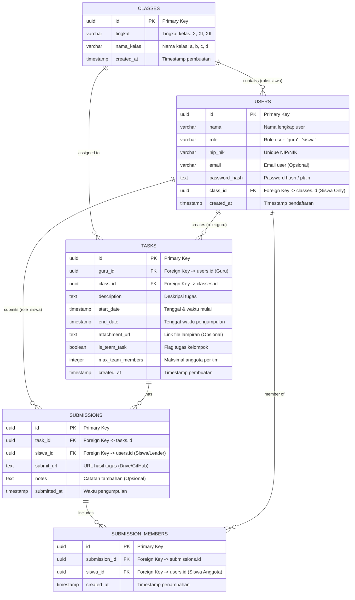
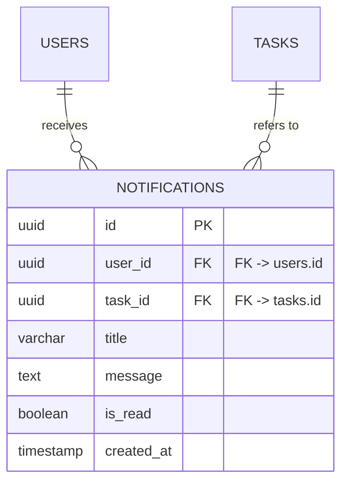

# Database Schema Documentation & ER Diagram

This document contains the complete database schema structure and Entity-Relationship (ER) diagram formatted in Mermaid for the Flutter Task Management application.

---

## Mermaid ER Diagram

---

## Detailed Table Dictionary

### 1. `classes` Table
Stores high school grade levels and class designations.
- **Constraints**: `UNIQUE(tingkat, nama_kelas)`

### 2. `users` Table
Stores both Teacher (`guru`) and Student (`siswa`) accounts.
- **Constraints**: `nip_nik` is UNIQUE. `class_id` references `classes(id)` ON DELETE SET NULL.

### 3. `tasks` Table
Stores tasks assigned by teachers to specific target classes.
- **Foreign Keys**: `guru_id` -> `users(id)`, `class_id` -> `classes(id)`.
- **Team Fields**: `is_team_task` (boolean), `max_team_members` (integer).

### 4. `submissions` Table
Stores student task submissions (individual or team leader submissions).
- **Foreign Keys**: `task_id` -> `tasks(id)`, `siswa_id` -> `users(id)`.

### 5. `submission_members` Table
Junction table mapping all group members participating in a team task submission.
- **Foreign Keys**: `submission_id` -> `submissions(id)`, `siswa_id` -> `users(id)`.
- **Constraints**: `UNIQUE(submission_id, siswa_id)`

---

## Optional Extension: `notifications` Table (Drafted)

